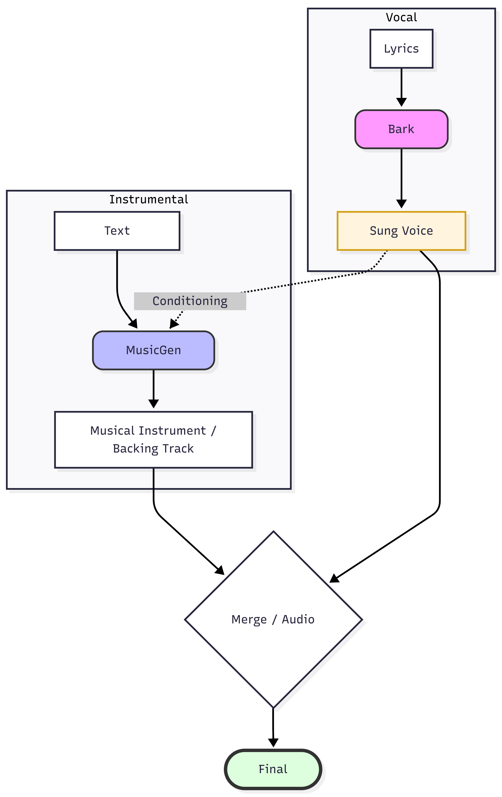

# Lyrics to song
This project presents an approach to building a generative AI system that creates complete songs from lyrics + genre.

--------------------------
## How to Run the Demo

** IMPORTANT HARDWARE **
This pipeline uses two large generative models.
* **GPU is required:** Running this on a CPU is **extremely slow** (it may take hours to generate seconds of audio).
* **VRAM:** A GPU with at least 12GB of VRAM is recommended.

### Option 1: The Easy Way (Recommended - Kaggle)
The most efficient way to run this without configuring a local environment is to use Kaggle's free GPU notebooks.

1.  **Create a Kaggle Notebook:** Go to [Kaggle](https://www.kaggle.com/) and upload the notebook app-demo.ipynb and click edit and run all.
2.  **Select Accelerator:** In the notebook settings (sidebar), set **Accelerator** to `GPU T4 x2` (or better).
4.  **Run the Code:** Copy the full project code below into a cell and execute it.
5.  **Launch:** Click the public Gradio link generated at the bottom of the output (e.g., `Running on public URL: https://...`).

### Option 2: Local Installation
If you want to run it in the local:

1.  **Install Requirements:**
    ```bash
    pip install gradio transformers torch scipy numpy librosa
    ```
2.  **Run the notebook app-demo.ipynb in notebooks folder.**

---

### how system works
A song can be viewed as two main components:
instrumentals + vocals (the lyrics sung by a voice).

Based on this idea, we designed an architecture composed of two models:



- Singing Voice Synthesis: We use the Bark model to generate the sung vocals directly from the lyrics.
- Instrumental Generation: We use MusicGen-Melody, which takes the melody and the genre (description of the the instrument) as input and generates the instrumental track.
